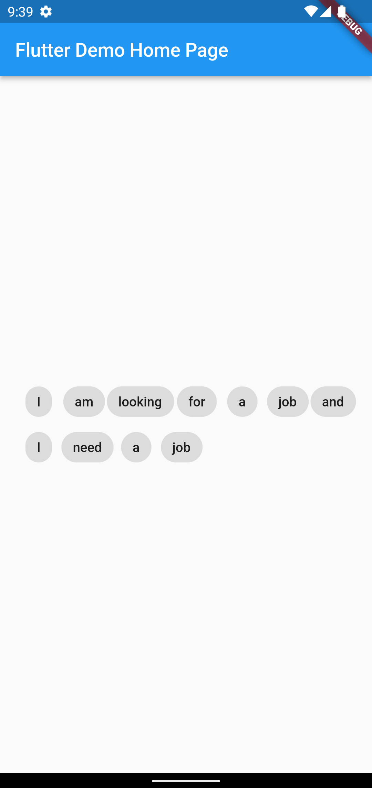

1. Refactor the code below so that the children will wrap to the next line when
the display width is small for them to fit.
    
**Solution:** 

```        
import 'package:flutter/material.dart';

class WrapWidget extends StatelessWidget {
  const WrapWidget({Key? key}) : super(key: key);

  @override
  Widget build(BuildContext context) {
    return Wrap(
      children: const [
        Chip(
          label: Text('I'),
        ),
        Chip(
          label: Text('am'),
        ),
        Chip(
          label: Text('looking'),
        ),
        Chip(
          label: Text('for'),
        ),
        Chip(
          label: Text('a'),
        ),
        Chip(
          label: Text('job'),
        ),
        Chip(
          label: Text('and'),
        ),
        Chip(
          label: Text('I'),
        ),
        Chip(
          label: Text('need'),
        ),
        Chip(
          label: Text('a'),
        ),
        Chip(
          label: Text('job'),
        ),
      ],
    );
  }
}
```

Output: 


2. Identify the problem in the following code block and correct it.

```
    String LongOperationMethod(int number){
        var counting = 0;
        for(var i=1;1<=10000000000;i++){
            counting = i;
        }
        return '$counting! times I print the value!';
    }
```    

**Solution:**
        The method needs has a for loop which needs to loop through a billion times, which is an expensive task, considering Dart running in a Single isolate or thread this could lead to blocking of the App  (App not responding error or issue).

        To resolve the issue we need to execute or run this method in a separate isolate which could be done using a 'compute'
        
        Future<String> separateIsolate() async{
            return await compute(LongOperationMethod, 10000000000);
        }

        String LongOperationMethod(int number){
        var counting = 0;
        for(var i=1;1<=number;i++){
            counting = i;
        }
        return '$counting! times I print the value!';
    }

3. In the below code, list1 declared with var, list2 with final and list3 with const. What is the difference between these lists? Will the last two lines compile?
    ```
        var list1 = ['1', '2', '3']; // line 1

        final list2 = list1; // line 2

        list2[2] = 'Dart'; // line 3

        const list3 = list1 //line 4
    ```    

    **Solution :**

        Line 3 will compile because, 'final' is Runtime constant and we are changing value of an index so this will work

        Line 4 will not compile because 'const' is compile time constant and also we are trying assign a variable instead of fixed value which wont change.
